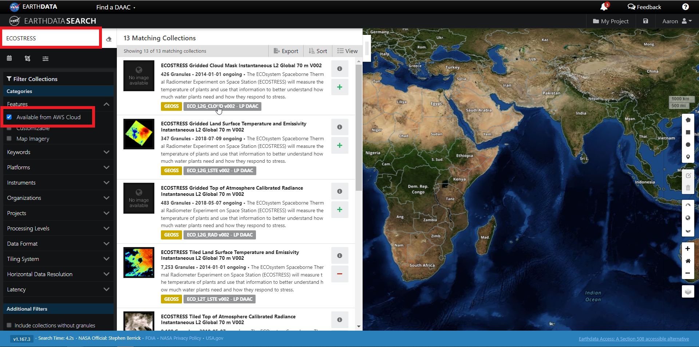
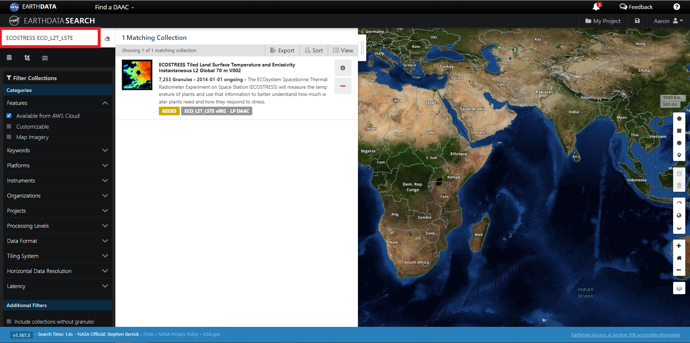
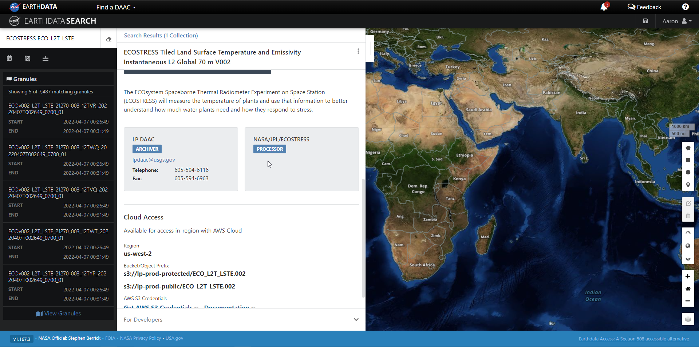
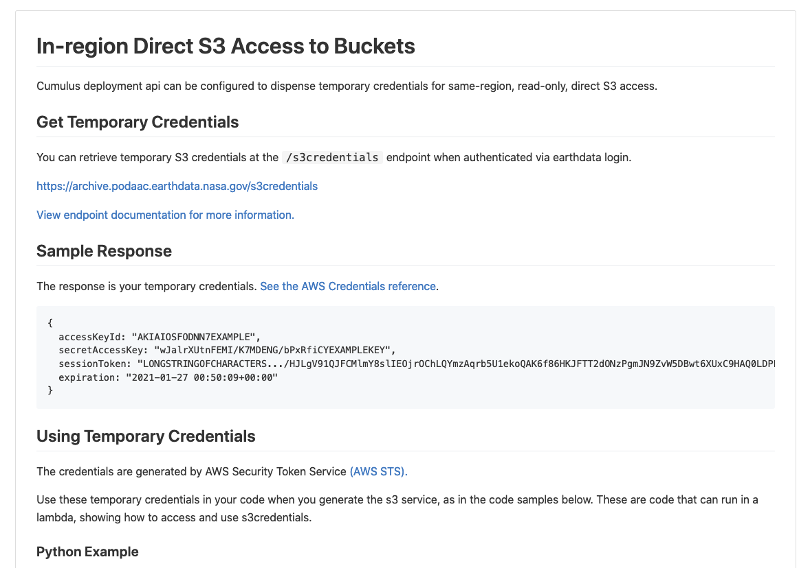
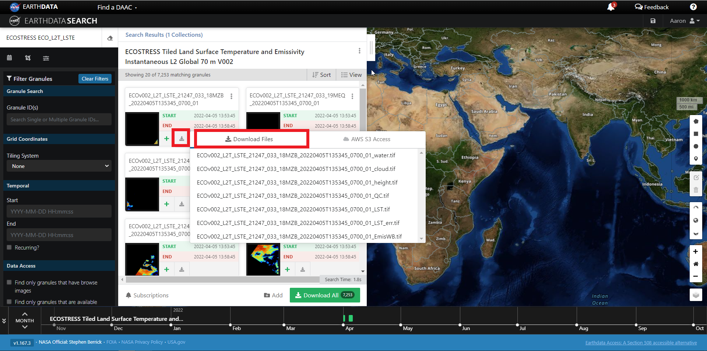
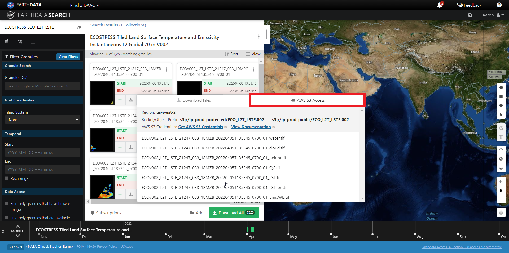
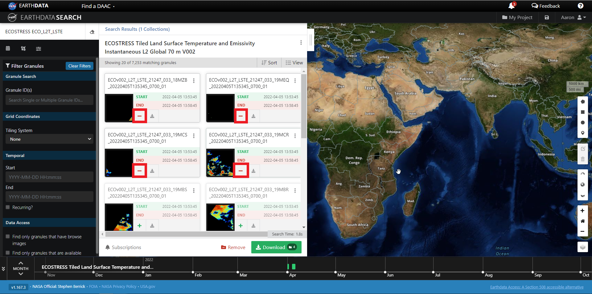
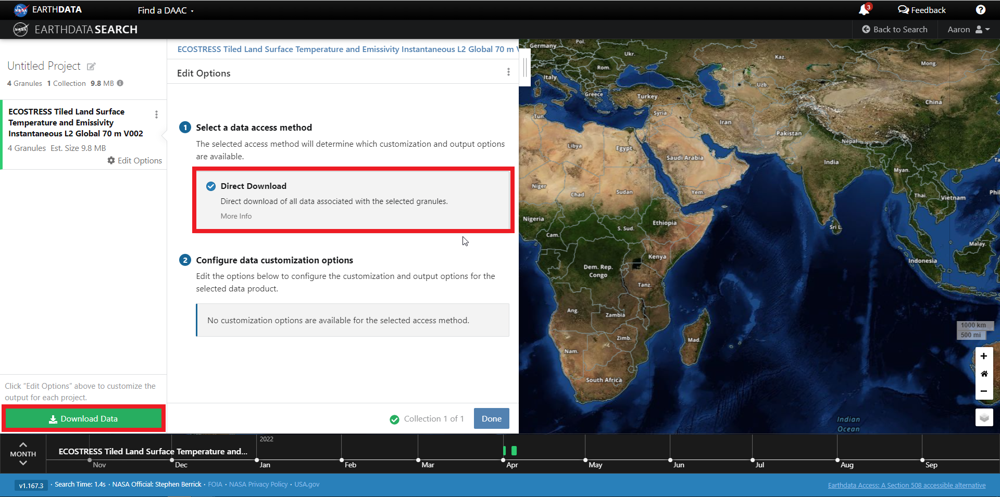
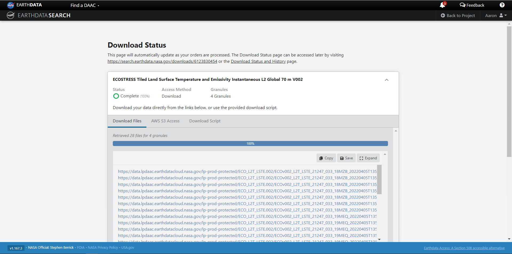
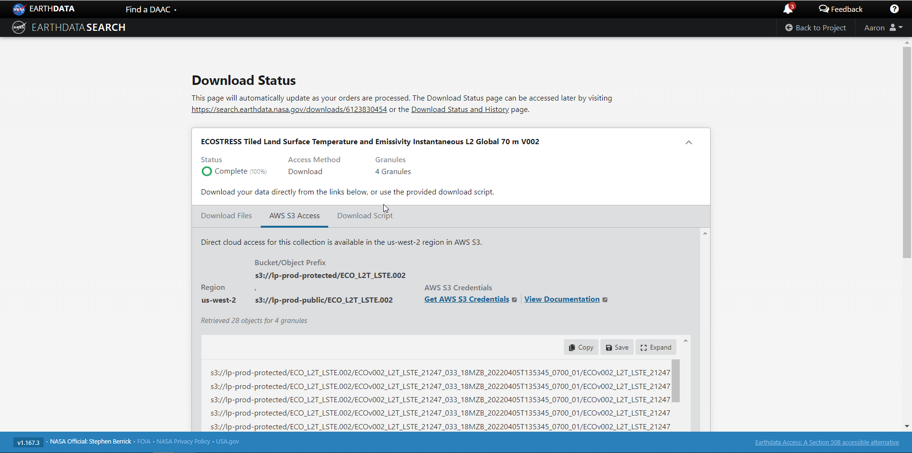

This tutorial guides you through how to use [Earthdata Search](https://search.earthdata.nasa.gov/) for NASA Earth observations search and discovery, and how to connect the search output (e.g. download or access links) to a programmatic workflow (locally or from within the cloud).  

### Step 1. Go to Earthdata Search and Login  

Go to Earthdata Search <https://search.earthdata.nasa.gov> and use your Earthdata login credentials to log in. If you do not have an Earthdata account, please see the [Workshop Prerequisites](https://nasa-openscapes.github.io/2021-Cloud-Workshop-AGU/logistics/prerequisites.html) for guidance.  

### Step 2. Search for dataset of interest  

Use the search box in the upper left to type key words. In this example we are interested in the [ECOSTRESS LSTE](https://search.earthdata.nasa.gov/search/granules?p=C2076090826-LPCLOUD&pg[0][v]=f&pg[0][gsk]=-start_date&q=LPCLOUD%20ECOSTRESS&tl=1649698992.323!3!!) which is managed by the LP DAAC and made available from the NASA Earthdata Cloud archive hosted in AWS cloud.  

Type **ECOSTRESS** in the search bar Click on the **"Available from AWS Cloud"** filter option on the left.  

  

Let's refine our search further. Let's search for `ECOSTRESS ECO_L2T_LSTE` in the search box. A single Earthdata Seach Collection is returned.  

We can click on the (i) icon for the dataset to read more details, including the **dataset shortname** (helpful for programmatic workflows) just below the dataset name; here `ECO_L2T_LSTE`.  

  

### Step 3. Explore the dataset details, including Cloud Access information  

Once we clicked the (i), scrolling down the info page for the dataset we will see Cloud Access information, such as:  

- whether the dataset is available in the cloud  
- the cloud **Region** (all NASA Earthdata Cloud data is/will be in `us-west-2` region)  
- the S3 storage **bucket** and **object prefix** where this data is located  
- link that generates **AWS S3 Credentials** for in-cloud data access (we will cover this in the Direct Data Access Tutorials)  
- link to **documentation** describing the In-region Direct S3 Access to Buckets. *Note*: these will be unique depending on the DAAC where the data is archived. (We will show examples of direct in-region access in Tutorial 3.)  

  

  

**Note**: Clicking on "For Developers" to exapnd will provide programmatic endpoints such as those for the CMR API, and more.  

For now, let's say we are intersted in getting download link(s) or access link(s) for specific data files (granules) within this collection.  

At the top of the dataset info section, click on *Search Results*, which will take us back to the list of datasets matching our search parameters. Clicking on the dataset (`ECOSTRESS ECO_L2T_LSTE`) we now see a list of files (granules) that are part of the dataset (collection).  

### Step 4a. Download or data access for a single granule  

To download files for a granule click the download arrow on the card (or list row)  

  

You can also get the S3 information (e.g., AWS region, bucket, temperary credentials for S3 access, and file names) by selecting the **AWS S3 Access** tab.  

  

#### Step 4b. Download or data access for multiple granule  

To download multiple granules, click on the green **+** symbol to add files to our project. Click on the green button towards the bottom that says "Download". This will take us to another page with options to customize our download or access link(s).  

  

On the next page click the **Direct Download** option and click the green **Download Data** on the bottom left side of the page.  

  

We're now taked to the final page for instructions to download and links for data access in the cloud. You should see three tabs: `Download Files`, `AWS S3 Access`, `Download Script`:  

  

  

The *Download Files* tab provides the `https://` links for downloading the files locally  

The *AWS S3 Access* tab provides the `S3://` links, which is what we would use to access the data directly in-region (us-west-2) within the AWS cloud.  
